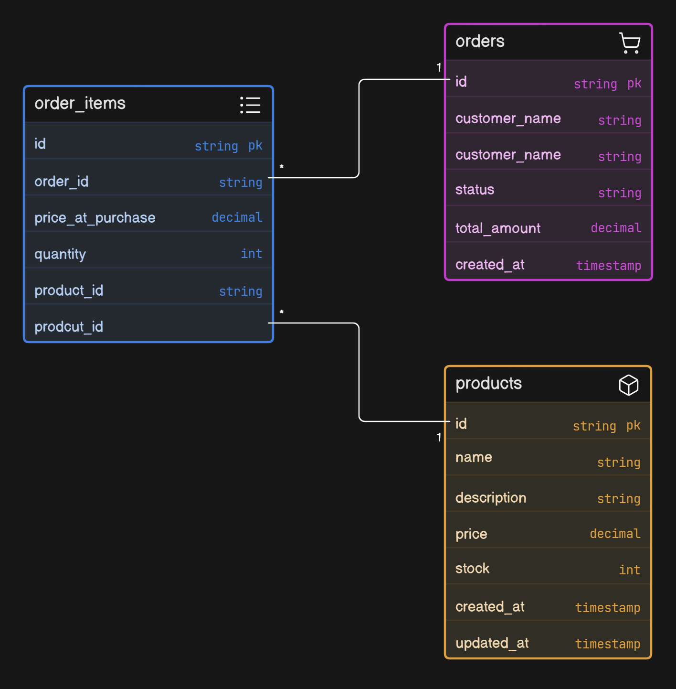

# E-Commerce Order Management API

A minimalist Java Spring Boot REST API for managing product catalogs and processing customer orders.

##  Database Design

* **Orders (1) to Order Items (*)** — One order can contain multiple items.
* **Products (1) to Order Items (*)** — A product can appear across multiple orders.

---

##  Tech Stack
* Java & Spring Boot
* Spring Data JPA
* Relational Database (MySQL/PostgreSQL/H2)

---

##  Features & Capabilities

### Creator Role
* Add new products to the catalog
* Update or delete existing products
* Browse all available products

### Customer Role
* Browse available products or view individual details
* Place new orders
* View complete order history

---

##  API Endpoints

### Product Management
* `POST /products` — Create a product
* `PUT /products/{id}` — Update a product
* `GET /products` — Get all products
* `GET /products/{id}` — Get a single product
* `DELETE /products/{id}` — Delete a product

### Order Management
* `POST /orders` — Place an order
* `GET /orders/{id}` — Get an order by ID
* `GET /orders` — Get all orders

---

